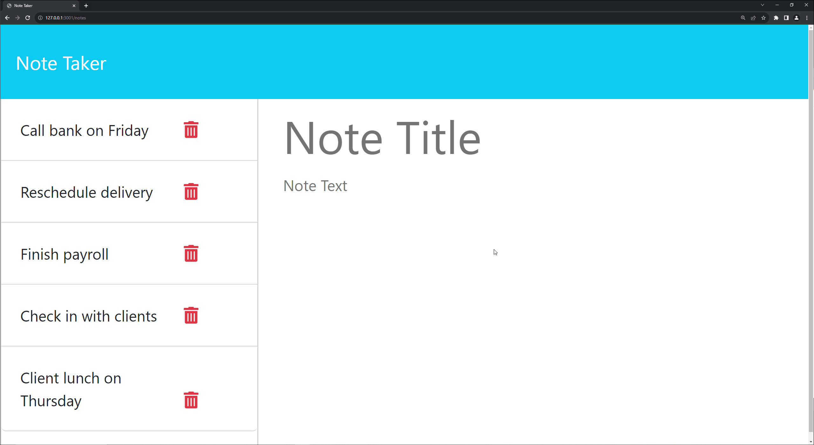

# Welcome to Note-RunnerRunner📑
    

## Description  

This application is a note-taking tool that allows users to create, save, and manage notes through a user-friendly interface.

## Content  
- [Installation](#Installation)
- [Usage](#Usage)
- [Link](#Link)
- [Demo](#Demo)
- [Installation](#Installation)
- [License](#License)
- [Contributing](#Contributing)
- [Tests](#Tests)
- [Questions](#Questions)

## Installation

Users are presented with a landing page featuring a link to access the notes page.

## Usage

Entering a new note title and its text triggers the appearance.
- To save the entered note.
- To clear the note entry fields.

## Link of deployed application

https://shielded-tundra-31652-cdf255acc529.herokuapp.com

## Demo

    
## License   

This application is covered under MIT License
(https://opensource.org/licenses/MIT)

## Contributing

Feel free to contribute to this project. Fork it and create a pull request to propose changes.

## Tests
    
## Questions
If you have any questions or issues, please feel free to reach out:
- GitHub:[https://github.com/DamirFM]

Do not hesitate to reach me with additional questions on my Email 
- Email:[yakupovdamir93@gmail.com]
    